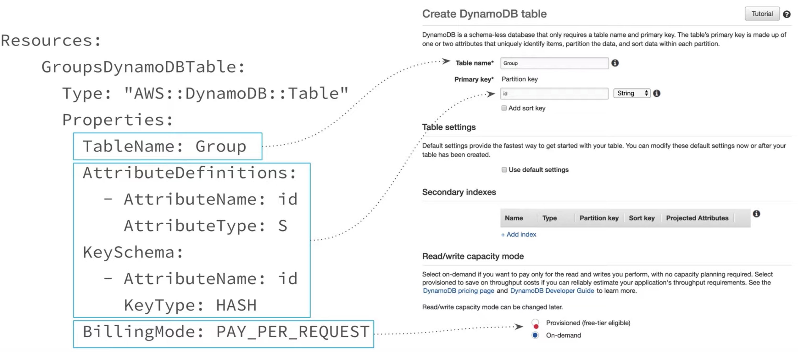

# full-stack-serverless

## CloudFormation
- Services for creation and management of AWS resources
- Write YAML/Json config file
- Upload template to cloudformation to craete Stack (S3 buckets, DynamoDB, APIs)
- Parameters, Resources, Condition, Output
