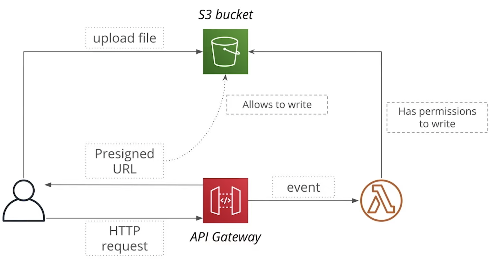

# Serverless BackEnd
## CloudFormation
- Services for creation and management of AWS resources
- Write YAML/Json config file
- Upload template to cloudformation to craete Stack (S3 buckets, DynamoDB, APIs)
- Parameters, Resources, Condition, Output

## DynamoDB
A composite key in DynamoDB consists of two elements
- Partition key - what partition to write item to
- Sort key - to sort elements with the same partition key

DynamoDB supports two indexes types:

Local secondary index (LSI):

- Like an additional sort key
- Allows to sort items by a different attribute
- Added on the data in a table

Global secondary index (GSI)

- Allows to define a new partition key for the same data
- Allows to define a new partition and sort key for the same data
- Creates copy of the data in a table (data is available via GSI after some delay)

## Image Storage
Use PreSigned URL
- Special URL pointing to an S3 bucket
- Can be used by anyone to upload/read an object (Even if an S3 bucket if private)
- Lambda function an generate Presigned URL, and had write permission to S3 bucket
- Won't write to the bucket itself
- Won't generate URL without correct permissions.
